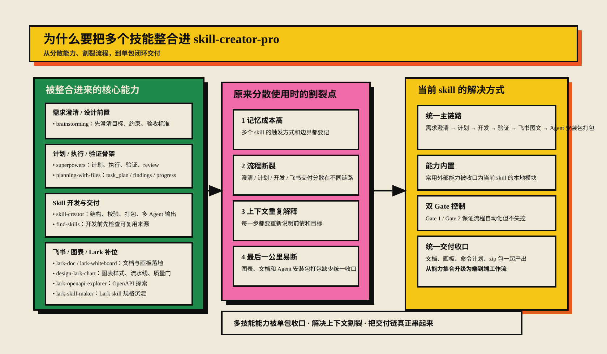
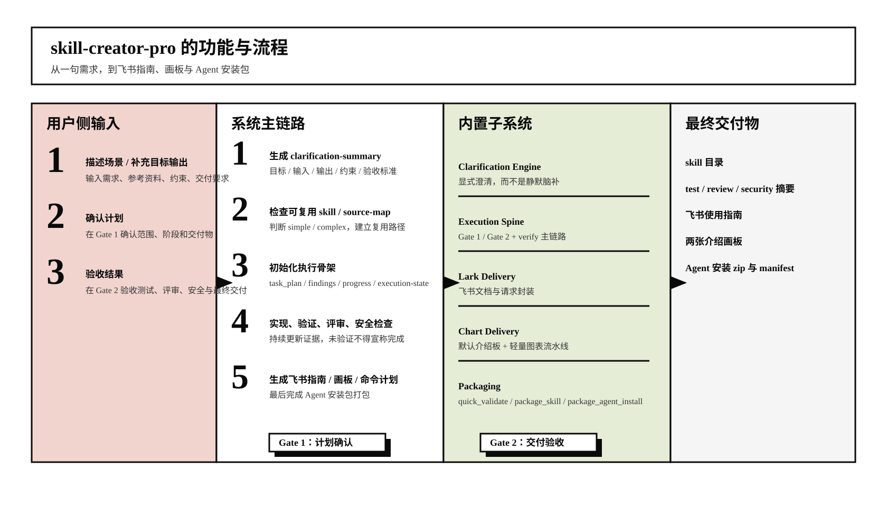

# skill-creator-pro

skill-creator-pro 是一个面向多 Agent 的单包 Skill 自动开发器。它把需求澄清、复用检索、计划生成、开发执行、测试验证、评审、安全检查、飞书指南、默认介绍画板，以及 Agent 安装包打包整合进一个技能目录里，目标是让用户只安装这一个技能，就能完成从场景描述到 skill 交付的闭环。

## 核心能力

- 显式需求澄清与双 Gate 流程控制
- simple / complex 自动分流
- 内置执行骨架：plan / findings / progress / acceptance
- 飞书指南、画板、命令计划一体化交付
- Agent 安装包与标准 zip 打包
- 本地验证、review、安全摘要产出

## 目录说明

- `SKILL.md`：技能定义与使用说明
- `scripts/`：澄清、执行、打包、校验、飞书交付等本地脚本
- `references/`：内置参考技能与规则文档
- `assets/`：模板、样式、预览与图表资源
- `evals/`：示例与评估产物
- `dist/`：构建后的 zip、manifest 与 staging 产物
- `reports/`：验证、测试、评审、安全摘要

## 主要产物

- `dist/skill-creator-pro.zip`
- `dist/skill-creator-pro-agent-install.zip`
- `dist/agent-install-manifest.json`

## 本地验证

```bash
python3 -m pytest -q
python3 scripts/verify_bundle.py .
```
